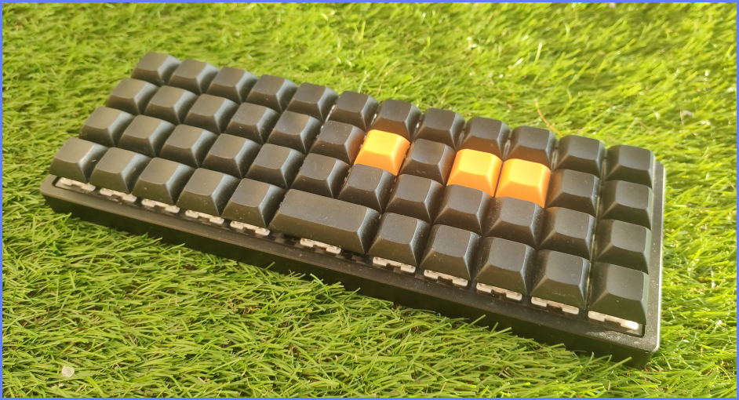

After 3 years of using this beast I'm not satisfied and I will move to split-keyboard since I want to try new ergonomics. It's still better than most of staggered, rubber keyboards out there.

# Layouts

QWERTY... [read pdf](keymap.pdf)
